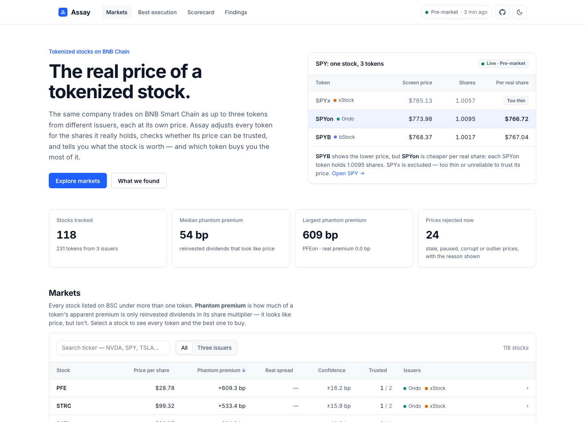
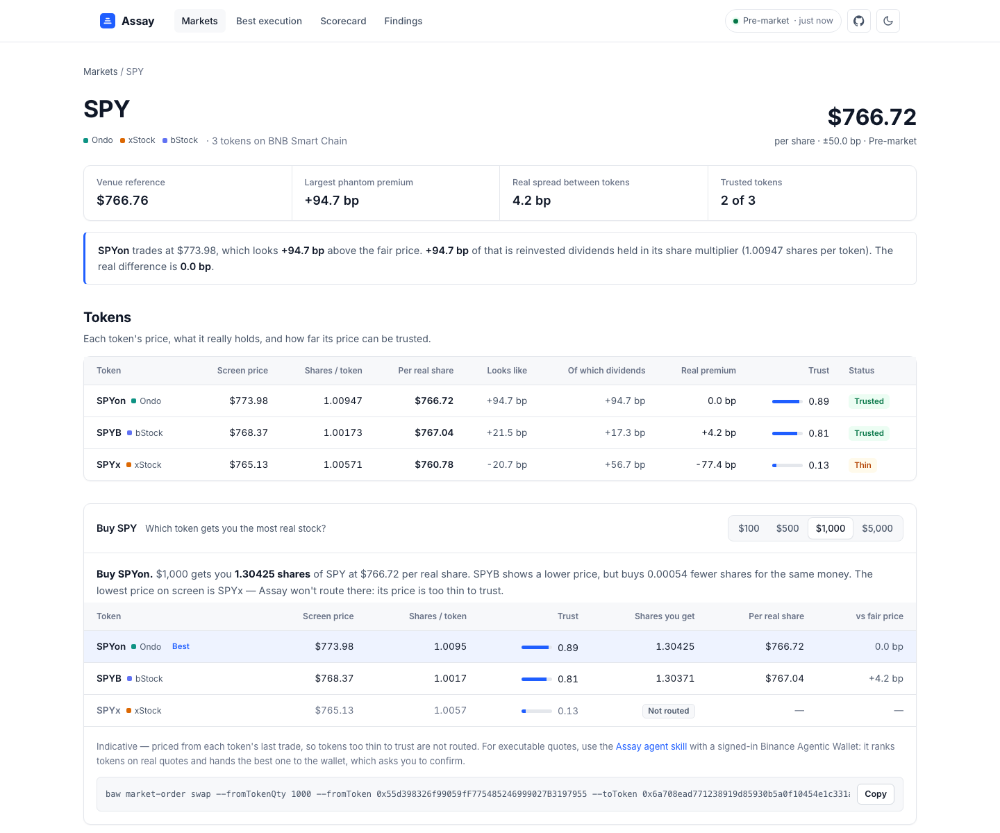

# Assay

**The real price of a tokenized stock.**

**Live → [assay-woad.vercel.app](https://assay-woad.vercel.app)** · priced from Binance on every visit

Built for BNB Hack: Tokenized Stocks Edition. [Developer Experience Report →](DEVEX.md)

[](https://github.com/techbone/assay/actions/workflows/ci.yml)



---

## The problem

On BNB Smart Chain the same stock trades as up to three tokens from three issuers — Ondo (`NVDAon`),
xStocks (`NVDAx`), bStocks (`NVDAB`) — at three different prices. There are **667 tokenized stock
tokens on BSC covering 512 tickers**; 37 mega-caps carry all three.

Those prices are not comparable. Each token carries a `sharesMultiplier` — how many real shares it
represents — that drifts upward as dividends reinvest and jumps on splits and fractionalization.
Observed range on BSC: **0.0667 to 10.03**. And a quoted price says nothing about whether anyone is
actually trading at it.

So the obvious product — compare the prices, buy the cheapest — is wrong. Sometimes by 10x.

## What Assay found, on live data

**Most apparent premiums are not real.** Dividing by the multiplier takes Ondo's basis error against
the underlying stock from a **533bp worst case to 5.3bp**, across 84 tickers. `SPYon` looks 95bp
expensive; it is at fair value to within 0.1bp.

> *NVDAon looks 17bp rich. All 17bp is accrued dividends held inside the multiplier. The real basis is ~0.*

**Half of one issuer's prices are unusable.** 22 of 43 xStock quotes on BSC — **51%** — fail basic
price sanity: `GMEx` at +855% of its reference, `UBERx` at −88%, served through the same field as
prices accurate to 1bp.

**The cheaper token can buy less stock.** On an executable Binance Agentic Wallet quote, `NVDAB`'s
token is cheaper than `NVDAon`'s, yet $500 of `NVDAon` buys more Nvidia. And the cheapest token of
all is often the trap: $1,000 of `SPYx` — screen price $765 — quoted **0.075 shares, about $57 of
stock**. `NVDAx` returned *no liquidity* at all.

**Binance's own router ignores the multiplier.** The Agentic Wallet prices Ondo tokens as if one
token were one share, so selling `PFEon` through it gives up **~6%** — every reinvested dividend.
Measured across six stocks and reproducible with `skills/assay/scripts/router-check.mjs`
([details](DEVEX.md#the-router-prices-ondo-tokens-per-share-not-per-token--critical)). These are
quotes, not settled trades.

## What it does

- **One reference price per stock** — trust-weighted across every wrapper, with a confidence band.
- **Every apparent premium split in two** — the part that is only the multiplier, and the part that
  is real.
- **A trust score per wrapper** — liquidity, freshness, metadata agreement. Halted, stale, corrupt
  and outlier quotes are rejected, with the reason shown.
- **Best execution** — "buy $500 of NVDA" ranked by *real shares received*, not token price. Thin
  wrappers are never recommended on a stale print.
- **An agent skill** that composes with Binance's Agentic Wallet: Assay decides what to buy on
  executable quotes, the wallet buys it after the user confirms.
- **A public scorecard** that grades Assay against the alternatives at every US market open.

## Is it better than just picking one issuer?

At each US open, Assay scores every estimate a user could have formed just before it — including
the ones that might beat it — against the price that actually printed. Four opens, 466 scored
tickers, as of 29 Sep ([live](https://assay-woad.vercel.app/#/scorecard)):

| estimator | mean error | median | n |
|---|---:|---:|---:|
| **assay** — the full engine | **24.5bp** | 14.2bp | 466 |
| only Ondo — always use one issuer | 24.9bp | 14.4bp | 466 |
| venue reference — Binance's own pre-open price | 38.1bp | 23.5bp | 466 |
| adjusted median — multipliers, no trust | 472bp | 17.6bp | 466 |
| raw median — compare token prices | 554bp | 37.2bp | 466 |

Honest reading: Assay beats the venue's own reference by 36%, and the naive methods by ~20x. Against
"always use Ondo" it leads narrowly, and four opens is a small sample. Its real advantage there is
that it doesn't need to know in advance which issuer to trust — it works that out, and adapts the day
that issuer halts, goes stale or ships a bad multiplier.

## The site

| Page | What it shows |
|---|---|
| [Markets](https://assay-woad.vercel.app) | Every stock with more than one token, ranked by phantom premium, searchable |
| [A stock](https://assay-woad.vercel.app/#/t/SPY) | Each token's screen price, shares per token, price per real share, trust — and what part of any premium is real |
| [Best execution](https://assay-woad.vercel.app/#/buy/SPY) | Which token buys the most real stock for your money |
| [Scorecard](https://assay-woad.vercel.app/#/scorecard) | Assay against every alternative at each US market open |
| [Findings](https://assay-woad.vercel.app/#/findings) | Each headline number, linked to the test or script that reproduces it |



Light and dark themes follow your system setting.

## How it runs

```
browser ── /api/* ──> Vercel function (Frankfurt) ──> Binance Web3 RWA API     live prices
                            │
                            └──> data branch ──>  recorded history, scorecard, coverage
                                     ▲
collector ── every 2 min ── publish ─┘            550k observations since 20 Sep
```

Live prices need no memory, so they are computed on demand, statelessly, through the same engine
the tests pin. The scorecard and basis history need memory, so a collector records them and
publishes to the [`data`](https://github.com/techbone/assay/tree/data) branch. If the collector
stops, the site keeps serving live prices and says how old its recorded history is.

The function runs in Frankfurt because Binance's Web3 API excludes the US, which is Vercel's default
region.

## Use it from an agent

```bash
npx skills add techbone/assay/skills/assay
```

Then ask your agent *"buy $500 of NVDA on BSC"*. The [Assay skill](skills/assay/SKILL.md) pulls the
candidate wrappers from Assay, gets an executable quote for each from the Binance Agentic Wallet,
converts tokens to real shares, and hands the winner to the wallet skill — which runs its own
security checks and asks you to confirm. Assay never executes a trade.

Or from a terminal:

```bash
npm run buy -- NVDA 500
```

## Verify the claims

Every number above is reproducible. The regression suite pins them to live data captured during the
build:

```bash
npm install
npm test               # 126 tests
```

- `tests/engine.test.ts` — the phantom premium on 8 tickers, corrupt `NFLXx`/`TQQQx` multipliers
- `tests/corpus.test.ts` — the 533bp → 5.3bp result and the 51% xStock rejection, across 84 tickers
- `tests/route.test.ts` — the multiplier trap, the thin-wrapper guard, the router's per-share pricing
- `tests/present.test.ts` — unit tokens never reported as premiums; "trusted" means the same everywhere
- `tests/scorecard.test.ts`, `tests/live.test.ts`, `tests/collector.test.ts` — the rest

CI runs the typecheck, the suite and the Vercel build on every push.

## Run it

```bash
npm run station        # collector + local API + publishing, one terminal
npm run web            # UI dev server on :5173
npm run buy -- SPY 1000
npm run scorecard      # the leaderboard from local data
npm run vercel-build && npm run vercel:local   # the exact Vercel build, locally
```

On a network that blocks `binance.com` at DNS level, set `ASSAY_DNS=1.1.1.1,8.8.8.8`.

## Layout

```
src/reference/   the engine — normalize, validate, trust, assay, decompose
src/route/       best execution; Binance Agentic Wallet quotes
src/live/        the serverless API — live pricing, recorded-data relay
src/scorecard/   scoring every estimator at each US open
src/collector/   the recorder; src/store/ its append-only SQLite
skills/assay/    the agent skill
vercel/          Build Output for Vercel, and a local runner for it
web/src/pages/   the site's pages (Vite + React); web/src/components/ shared parts
```

[ARCHITECTURE.md](ARCHITECTURE.md) has the design, [DEVEX.md](DEVEX.md) the Developer Experience
Report, [docs/DEPLOY.md](docs/DEPLOY.md) how to run it.
